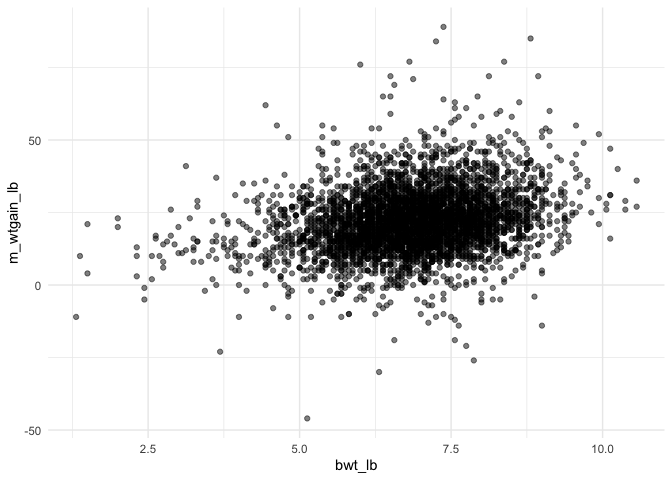
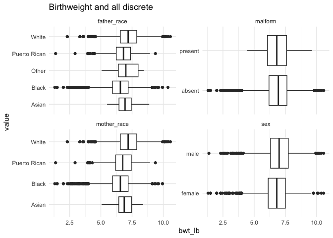
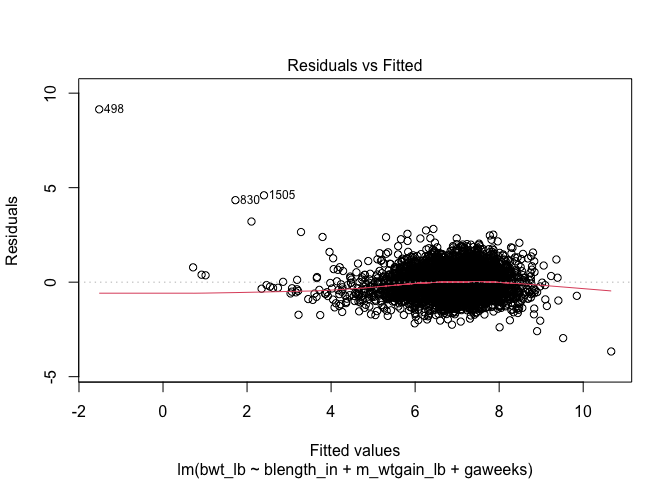
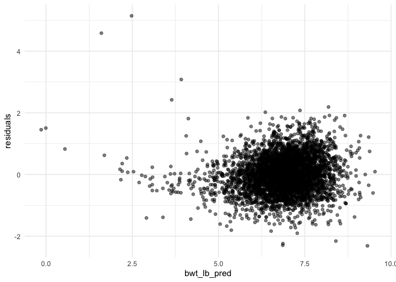
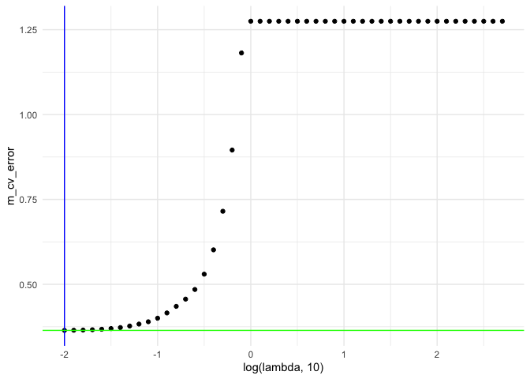
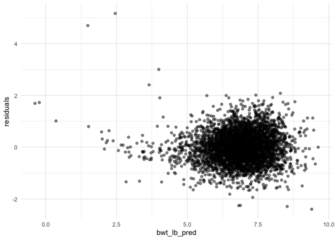
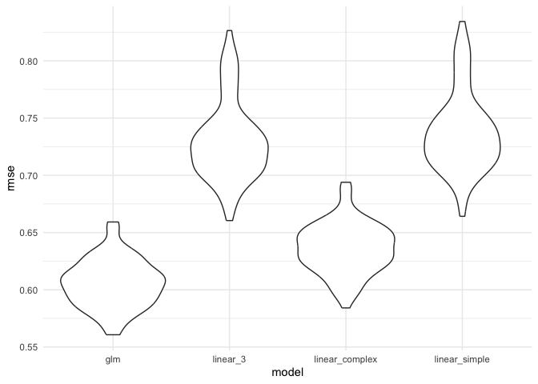

HW 6
================
Julia Gray
2025-11-17

## Problem 1

Get data:

``` r
homicide_df = read.csv("https://raw.githubusercontent.com/washingtonpost/data-homicides/master/homicide-data.csv") |> 
  janitor::clean_names() |> 
  mutate(
    reported_date = as.Date(as.character(reported_date), format = "%y%m%d"),
    city_state = paste(city, state, sep=", "),
    solved = as.numeric(disposition %in% c("Closed by arrest")),
    victim_age = as.numeric(victim_age),
    victim_race = fct_relevel(victim_race, "White")
  ) |> 
  filter(
    !city_state %in% c("Dallas, TX", "Phoenix, AZ", "Kansas City, MO", "Tulsa, AL"),
    !victim_age %in% c(NA),    #remove age is NA
    victim_race %in% c("White", "Black")
  )
```

    ## Warning: There was 1 warning in `mutate()`.
    ## ℹ In argument: `victim_age = as.numeric(victim_age)`.
    ## Caused by warning:
    ## ! NAs introduced by coercion

``` r
baltimore_df = homicide_df |> 
  filter(
    city_state == "Baltimore, MD"
  ) |> 
  select(solved, victim_age, victim_race, victim_sex)
```

Fit model for Baltimore:

``` r
or_balt = 
  baltimore_df |> 
  glm(solved ~ victim_age + victim_race + victim_sex, data = _, family = binomial()) 

or_balt |> 
  broom::tidy(conf.int = TRUE, exponentiate = TRUE) |> 
  select(term, estimate, conf.low, conf.high, p.value) |> 
  knitr::kable(digits = 3)
```

| term             | estimate | conf.low | conf.high | p.value |
|:-----------------|---------:|---------:|----------:|--------:|
| (Intercept)      |    3.164 |    1.998 |     5.057 |   0.000 |
| victim_age       |    0.993 |    0.987 |     1.000 |   0.043 |
| victim_raceBlack |    0.431 |    0.305 |     0.606 |   0.000 |
| victim_sexMale   |    0.426 |    0.324 |     0.558 |   0.000 |

Fit model for all cities:

``` r
fit_or = function(input_city){
  
  fit = 
    homicide_df |>
    filter(city_state == input_city) |>
    glm(formula = solved ~ victim_age + victim_race + victim_sex, data = _, family = binomial()) |>
    broom::tidy(conf.int = TRUE, exponentiate = TRUE) |>
    filter(term == "victim_sexMale") |>
    select(estimate, conf.low, conf.high, p.value)

  fit
}

ny_test = fit_or('New York, NY')

or_all_cities = 
  tibble(
    city_s = unique(pull(homicide_df, city_state))
    ) |> 
  mutate(fit_estimates = map(city_s, fit_or)) |> 
  unnest(fit_estimates)
```

    ## Warning: There were 43 warnings in `mutate()`.
    ## The first warning was:
    ## ℹ In argument: `fit_estimates = map(city_s, fit_or)`.
    ## Caused by warning:
    ## ! glm.fit: fitted probabilities numerically 0 or 1 occurred
    ## ℹ Run `dplyr::last_dplyr_warnings()` to see the 42 remaining warnings.

Plot the results

``` r
or_all_cities |> 
  mutate(city_s = fct_reorder(city_s, estimate)) |> 
  ggplot(aes(x = estimate, y = city_s)) + 
  geom_point() + 
  geom_errorbar(aes(xmin = conf.low, xmax = conf.high)) +
  geom_vline(xintercept = 1, color = "red") +
  xlim(0, 4) +
  ylab("City, State") +
  xlab("OR of homicide being solved (male vs. female)")
```


An odds ratio of 1 (shown on the plot as a red line), means there is no
difference in the odss of the homicide being solved between males and
females. An odds ratio greater than 1 means that homicides where the
victim is male have higher odds of being solved and vice versa. The
confidence interval is shown by the error bars and where it crosses 1
the results are not significant.

## Problem 2

Get the data:

``` r
data("weather_df")
```

Write the bootstrap function, run 5000 times and get $\widehat{r}^2$,
$\hat{\beta}_1$ and $\hat{\beta}_2$ :

``` r
get_bootstrap = function(df) {
  slice_sample(df, prop = 1, replace = TRUE)
}

#set this to 100 for now to make knitting faster - remember to change back to 5000
weather_sample_df = tibble(iter = 1:100) |> 
  mutate(
    bs_sample = map(iter, \(i) get_bootstrap(df = weather_df)),
    sample_lm = map(bs_sample, \(df) lm(tmax~tmin + prcp, data = df)),
    r_sq_hat = map(sample_lm, \(model) model |> 
                     broom::glance() |> pull(r.squared)),
    beta_1_hat = map_dbl(sample_lm, \(model) model |> 
                           broom::tidy() |> filter(term == "tmin") |> pull(estimate)),
    beta_2_hat = map_dbl(sample_lm, \(model) model |> 
                           broom::tidy() |> filter(term == "prcp") |> pull(estimate)),
    beta_ratio = beta_1_hat / beta_2_hat
  )
```

Plot the distribution of estimates:

``` r
b1_plot = weather_sample_df |> 
  ggplot(aes(x = beta_1_hat)) + geom_density()

b2_plot = weather_sample_df |> 
  ggplot(aes(x = beta_2_hat)) + geom_density()

b1_plot + b2_plot
```


$\hat{\beta}_1$ and $\hat{\beta}_2$ are both approximately normally
distributed with means 1.018 and -0.006.

Provide 95% confidence interval for $\widehat{r}^2$ and $\hat{\beta}_1$
/ $\hat{\beta}_2$ :

``` r
weather_sample_df |> 
  select(beta_1_hat, beta_2_hat, beta_ratio, r_sq_hat) |> 
  mutate(r_sq_hat = as.numeric(r_sq_hat)) |> 
  pivot_longer(
    cols = c(beta_1_hat, beta_2_hat, beta_ratio, r_sq_hat),
    names_to = "estimate",
    values_to = "value"
  ) |> 
  group_by(estimate) |> 
  reframe(
    ci.lower = quantile(value, probs = 0.025),
    ci.upper = quantile(value, probs = 0.975)
  ) |> 
  knitr::kable()
```

| estimate   |     ci.lower |     ci.upper |
|:-----------|-------------:|-------------:|
| beta_1_hat |    1.0067701 |    1.0252306 |
| beta_2_hat |   -0.0078664 |   -0.0038033 |
| beta_ratio | -267.4301170 | -129.4087458 |
| r_sq_hat   |    0.9349792 |    0.9460010 |

## Problem 3

Load and clean the data:

``` r
birth_df = read_csv('./data/birthweight.csv') |> 
  mutate(
    #convert categories to factors
    sex = as.factor(case_match(
      babysex,
      1 ~ "male", 
      2 ~ "female"
    )),
    father_race = as.factor(case_match(
      frace,
      1 ~ "White",
      2 ~ "Black",
      3 ~ "Asian",
      4 ~ "Puerto Rican",
      8 ~ "Other",
      9 ~ "Unknown",
    )),
    mother_race = as.factor(case_match(
      mrace,
      1 ~ "White",
      2 ~ "Black",
      3 ~ "Asian",
      4 ~ "Puerto Rican",
      8 ~ "Other",
      9 ~ "Unknown",
    )),
    malform = as.factor(case_match(
      malform,
      0 ~ "absent",
      1 ~ "present"
    )),
    #convert all units to lbs and inches:
    blength_in = blength / 2.54,
    bhead_in = bhead / 2.54,
    bwt_lb = bwt / 453.6, # converting from grams to lbs
  ) |> 
  rename(
      avg_cig_per_day = smoken,
      m_wt_lb = delwt,
      m_ppwt_lb = ppwt,
      m_ppbmi = ppbmi,
      m_age_delivery = momage,
      m_age_menarche = menarche,
      m_wtgain_lb = wtgain,
      m_height = mheight
    ) |> 
  select(sex, father_race, mother_race, blength_in, bhead_in, bwt_lb, fincome,
         gaweeks, malform, m_height, m_wt_lb, m_ppwt_lb, m_wtgain_lb,
         m_age_delivery, m_age_menarche, avg_cig_per_day, parity, pnumlbw, pnumsga)
```

    ## Rows: 4342 Columns: 20
    ## ── Column specification ────────────────────────────────────────────────────────
    ## Delimiter: ","
    ## dbl (20): babysex, bhead, blength, bwt, delwt, fincome, frace, gaweeks, malf...
    ## 
    ## ℹ Use `spec()` to retrieve the full column specification for this data.
    ## ℹ Specify the column types or set `show_col_types = FALSE` to quiet this message.

Look at scatterplots for all continuous variables:

``` r
birth_df |> 
  select(-sex, -father_race, -mother_race, -malform) |> 
  pivot_longer(cols = c("blength_in", "bhead_in", "gaweeks", "fincome", "m_height", "m_wt_lb", "m_ppwt_lb", "m_wtgain_lb", "m_age_delivery", "m_age_menarche","avg_cig_per_day","parity","pnumlbw","pnumsga"), names_to = "variable", values_to = "value") |> 
  ggplot(aes(x = bwt_lb, y = value)) +
  geom_point() +
  facet_wrap(~ variable, scales = "free_y") + # 'scales = "free_y"' allows y-axes to vary
  labs(title = "Birthweight and all continuous variables")
```



Look at boxplots for all discrete variables:

``` r
birth_df |> 
  select(bwt_lb, sex, father_race, mother_race, malform) |> 
  pivot_longer(cols = c("sex", "father_race", "mother_race", "malform"), names_to = "variable", values_to = "value") |> 
  ggplot(aes(x = bwt_lb, y = value)) +
  geom_boxplot() +
  facet_wrap(~ variable, scales = "free_y") + # 'scales = "free_y"' allows y-axes to vary
  labs(title = "Birthweight and all discrete")
```



Use a simple linear regression model using 3 predictors that look the
most highly correlated in the scatterplots:

``` r
lm_3_predictors = function(df) {
  lm(bwt_lb ~ blength_in + m_wtgain_lb + gaweeks, data = df)
}

lm_3_fit = lm_3_predictors(birth_df)

#check built in plots for diagnostics
#plot(lm_3_fit)
```

Get predictions and look at residuals:

``` r
birth_df |> 
  select(bwt_lb) |> 
  mutate(
    bwt_lb_pred = predict(lm_3_fit, newx = x),
    residuals = bwt_lb - bwt_lb_pred
  ) |> 
  ggplot(aes(x = bwt_lb_pred, y = residuals)) +
  geom_point(alpha = 0.5)
```



This looks ok, the residuals are arranged in a cloud around 0 with no
obvious pattern.

For practice, use LASSO to build model:

``` r
x = model.matrix(bwt_lb ~ ., birth_df)[,-1]
y = birth_df |> pull(bwt_lb)

lambda = 10^(seq(-2, 2.75, 0.1))

lasso_fit =
  glmnet(x, y, lambda = lambda)

lasso_cv =
  cv.glmnet(x, y, lambda = lambda)

lambda_opt = lasso_cv[["lambda.min"]]
lambda_1se = lasso_cv[["lambda.1se"]] 

cv_min = lasso_cv |> broom::tidy() |> filter(lambda == lambda_opt) |> pull(estimate)
```

Plot models:

``` r
lasso_fit |> 
  broom::tidy() |> 
  select(term, lambda, estimate) |> 
  complete(term, lambda, fill = list(estimate = 0) ) |> 
  filter(term != "(Intercept)") |> 
  ggplot(aes(x = log(lambda, 10), y = estimate, group = term, color = term)) + 
  geom_path() + 
  geom_vline(xintercept = log(lambda_opt, 10), color = "blue", size = 1.2) +
  theme(legend.position = "none")
```

    ## Warning: Using `size` aesthetic for lines was deprecated in ggplot2 3.4.0.
    ## ℹ Please use `linewidth` instead.
    ## This warning is displayed once every 8 hours.
    ## Call `lifecycle::last_lifecycle_warnings()` to see where this warning was
    ## generated.



``` r
lasso_cv |> 
    broom::tidy() |> 
  mutate(
    m_cv_error = estimate # mean cross-validated error
  ) |> 
    ggplot(aes(x = log(lambda, 10), y = m_cv_error)) +
    geom_point() + 
  geom_vline(xintercept = log(lambda_opt, 10), color = "blue") + 
  geom_hline(yintercept = cv_min, color = "green") 
```



``` r
lasso_final_fit = glmnet(x, y, lambda = lambda_opt)
```

Get predictions and plot residuals:

``` r
birth_df |> 
  select(bwt_lb) |> 
  mutate(
    bwt_lb_pred = predict(lasso_final_fit, newx = x)[,1],
    residuals = bwt_lb - bwt_lb_pred
  ) |> 
  ggplot(aes(x = bwt_lb_pred, y = residuals)) +
  geom_point(alpha = 0.5)
```



Run comparison across models:

``` r
lm_main_effects = function(df) {
  lm(bwt_lb ~ blength_in + gaweeks, data = df)
}

lm_3_way_interaction = function(df) {
  lm(bwt_lb ~ bhead_in + blength_in + sex + 
       bhead_in*blength_in + bhead_in*sex + 
       blength_in*sex + bhead_in*blength_in*sex, 
     data = birth_df)
}

glm_lambda_opt = function(df) {
  y = df |> pull(bwt_lb) 
  x = model.matrix(bwt_lb ~., df)[,-1]
  glmnet(x, y, lambda = lambda_opt)
}

get_rmse = function(model, df) {
  
  x = model.matrix(bwt_lb ~., df)[,-1]
  
  df = df |> 
    mutate(bwt_lb_pred = predict(model, newx = x)[,1]) 
  
  actual = df |> pull(bwt_lb)
  predicted =  df |> pull(bwt_lb_pred)
  rmse = sqrt(mean((actual - predicted)^2))
  rmse
}
```

Perform cross-validation:

``` r
cv_df = 
  crossv_mc(birth_df, n = 100) |> 
  mutate(
    train = map(train, as_tibble),
    test = map(test, as_tibble)
  ) |> 
  #fit models => use training data
  mutate(
    glm = map(train, glm_lambda_opt),
    lm_3 = map(train, lm_3_predictors),
    lm_me = map(train, lm_main_effects),
    lm_3wi = map(train, lm_3_way_interaction)
  ) |> 
  #get rmse => use testing data
  mutate(
    rmse_glm = map2_dbl(glm, test, get_rmse),
    rmse_linear_3 = map2_dbl(lm_3, test, rmse),
    rmse_linear_simple = map2_dbl(lm_me, test, rmse),
    rmse_linear_complex = map2_dbl(lm_3wi, test, rmse)
  )
```

Look at the RMSE for each model:

``` r
cv_df |> 
  select(starts_with("rmse")) |> 
  pivot_longer(
    everything(),
    names_to = "model", 
    values_to = "rmse",
    names_prefix = "rmse_") |> 
  ggplot(aes(x = model, y = rmse)) + 
  geom_violin()
```



RMSE is lowest in glm model. While the simple linear model performed
slightly better with the added predictor `m_wtgain_lb` (mother’s weight
gain in pounds), it was significantly worse than both the linear model
with interactions and the LASSO model.

| model          | mean_RMSE |
|:---------------|----------:|
| glm            |     0.606 |
| linear_3       |     0.730 |
| linear_complex |     0.636 |
| linear_simple  |     0.738 |
